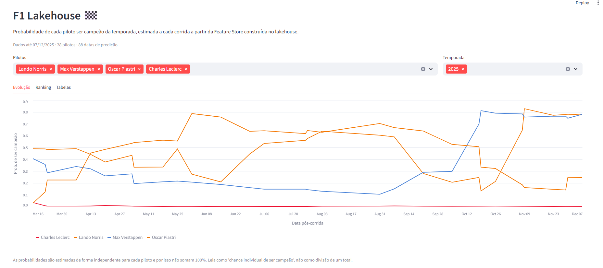
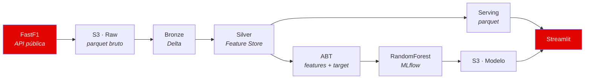

# F1 Lakehouse

Pipeline de dados ponta a ponta que coleta resultados históricos da Fórmula 1,
processa-os em arquitetura Medallion e treina um modelo de classificação para
estimar a probabilidade de cada piloto ser campeão da temporada.

O resultado é entregue em uma aplicação Streamlit que acompanha a evolução
dessa probabilidade corrida a corrida.

---

## Tecnologias

| Categoria | Ferramentas |
|---|---|
| **Linguagens** | Python, SQL |
| **Ingestão** | FastF1, boto3 |
| **Cloud & Storage** | AWS S3, Delta Lake, Parquet |
| **Lakehouse** | Apache Spark, Nekt |
| **Machine Learning** | scikit-learn, feature-engine, pandas |
| **MLOps** | MLflow |
| **Aplicação** | Streamlit |
| **Infraestrutura** | Docker, Docker Compose |

---

## Aplicação

**[Acessar a aplicação →](https://f1-lake-vejzebmppasmdxqzzkmglk.streamlit.app/)**



Evolução da probabilidade de título ao longo da temporada, com uma linha por
piloto na cor da equipe.

---

## Arquitetura



| Camada | Onde roda | O que faz |
|---|---|---|
| **Coleta** | Container (`main.py`) | Consome a API do FastF1 a cada 6h e grava parquet |
| **Raw** | AWS S3 | Dado bruto imutável, um arquivo por sessão |
| **Bronze** | Nekt / Spark | Consolidação em Delta, com histórico de modificações |
| **Silver** | Nekt / Spark | Feature Store por recorte temporal |
| **Gold / ABT** | Nekt + local | Junção das features com a variável alvo |
| **Modelo** | Local + MLflow | Treino, tracking de métricas e publicação do artefato |
| **Aplicação** | Streamlit | Carrega modelo e features e roda a inferência |

---

## Feature Store

A camada Silver materializa o histórico de cada piloto em três recortes
temporais, construídos com window functions no motor SQL:

| Tabela | Recorte |
|---|---|
| `fs_f1_driver_life` | Toda a carreira do piloto até a data de referência |
| `fs_f1_driver_last_10` | Últimas 10 corridas |
| `fs_f1_driver_last_20` | Últimas 20 corridas |
| `fs_f1_driver_all` | Junção das três, mais atributos do piloto |

Cada linha representa um piloto em uma data de corrida. A tabela consolidada
tem **17.531 linhas** e **129 features numéricas**.

---

## Serving

O modelo é carregado diretamente no processo da aplicação Streamlit.

Um script de ETL materializa o recorte de inferência a partir da mesma tabela
Silver que gerou a ABT de treino, e publica um parquet no S3. O recorte cobre
28 pilotos ativos em 88 datas de corrida e ocupa 0,4 MB, o que dispensa banco
de dados. O modelo treinado é copiado do MLflow para um caminho estável no S3,
de onde a aplicação o consome.

Como features de treino e de inferência saem da mesma origem, não há
recálculo em Python. A seleção de colunas usa `model.feature_names_in_`,
preservando nome e ordem exatos do treino.

---

## Modelo

`RandomForestClassifier` com 500 árvores e `min_samples_leaf=50`, precedido
de imputação por valor arbitrário.

A divisão treino/teste é estratificada por par `(piloto, ano)`, não por linha,
para que o mesmo piloto-temporada não apareça dos dois lados. A temporada de
2025 é reservada como *out-of-time*. As últimas 5 datas de cada ano são
excluídas do treino: nesse ponto o campeonato já está praticamente decidido e
o modelo aprenderia a ler o placar em vez de prever.

| Métrica | AUC |
|---|---|
| Treino | 0,9954 |
| Teste | 0,9954 |
| Out-of-time (2025) | 0,9602 |

---

## Como rodar

Cada camada declara suas dependências separadamente.

```bash
git clone https://github.com/vianahugo/f1-lake
cd f1-lake
cp .env.example .env    # preencha as credenciais
```

**Coleta e envio para o S3**

```bash
pip install -r requirements.txt
python collect.py -y 2026      # coleta uma temporada
python main.py                 # coleta contínua a cada 6h
```

**ETL e Feature Store** (requer conta na Nekt)

```bash
pip install -r etl/requirements.txt
python etl/main.py             # popula a Feature Store
python etl/download_abt.py     # exporta a ABT para treino
```

**Treino**

```bash
pip install -r ml_champion/requirements.txt
python ml_champion/train.py
python ml_champion/publish_model.py --run-id <RUN_ID>
```

**Aplicação**

```bash
pip install -r app/requirements.txt
python etl/export_serving.py
streamlit run app/streamlit_app.py
```

**Via Docker**

```bash
docker compose build
docker compose up
```

Sobem dois serviços: o coletor, em execução contínua, e a aplicação em
`localhost:8501`.

---

## Estrutura

```
.
├── collect.py                  # coleta via FastF1
├── sender.py                   # envio para o S3
├── main.py                     # agendador da coleta
├── etl/
│   ├── main.py                 # Feature Store na Nekt
│   ├── fs_drive.sql            # janelas temporais por piloto
│   ├── fs_all.sql              # consolidação da Feature Store
│   ├── abt_champions.sql       # variável alvo
│   ├── download_abt.py         # exporta a ABT
│   └── export_serving.py       # materializa o recorte de inferência
├── ml_champion/
│   ├── train.py                # treino e tracking
│   └── publish_model.py        # publica o modelo no S3
├── app/
│   └── streamlit_app.py        # aplicação
└── docker-compose.yaml
```

---

## Créditos

Projeto baseado no [f1-lake](https://github.com/TeoMeWhy/f1-lake) de
[Téo Me Why](https://twitch.tv/teomewhy), construído ao vivo com a comunidade.
Esta versão adapta o pipeline e substitui a camada de serving por inferência
em processo.

Dados obtidos via [FastF1](https://docs.fastf1.dev/).
